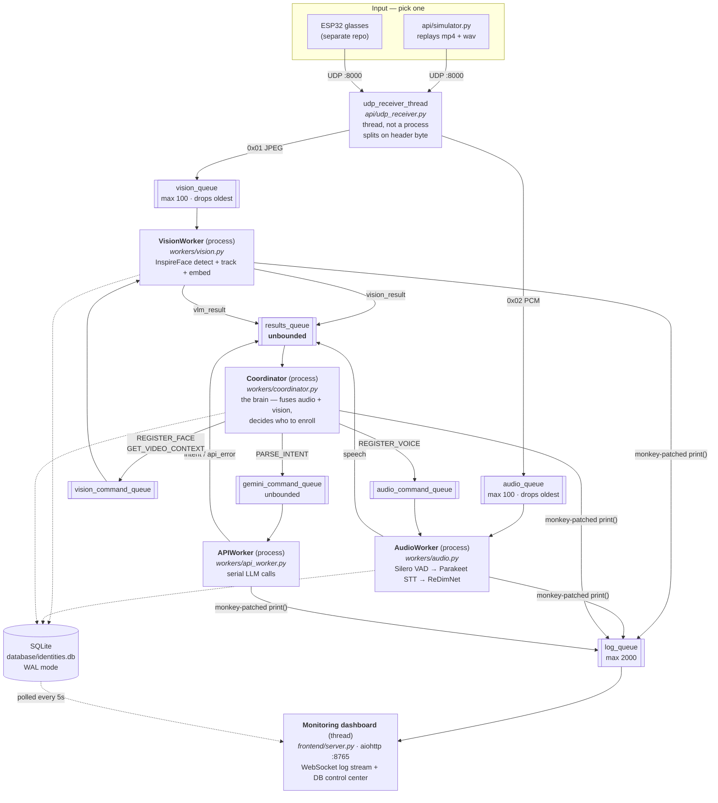
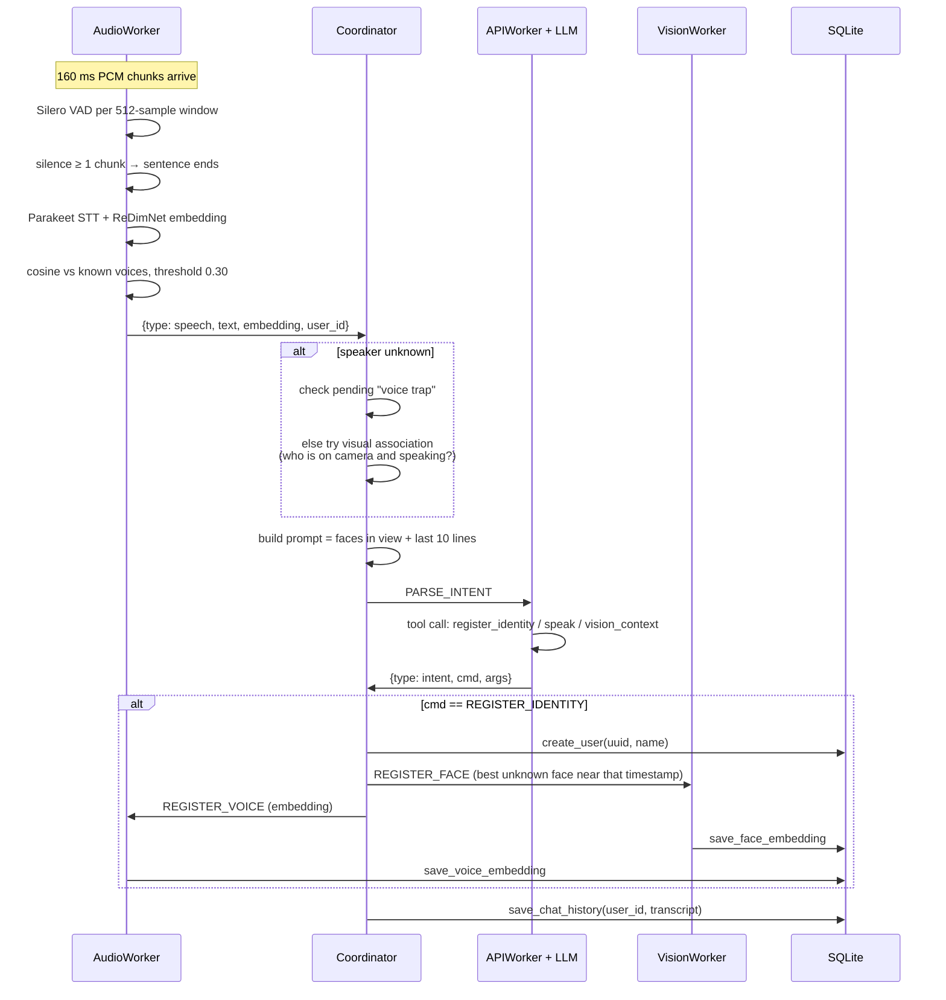
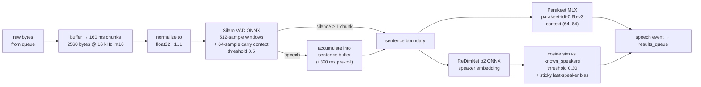
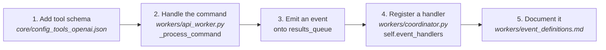

# Architecture

How this system is wired, where to make changes, and what is currently broken.
Read this before touching anything. Everything here was verified against the code at `main` (`527a897`).

Companion docs: `ROADMAP.md` (the 3-month plan), `workers/event_definitions.md` (event schemas), `database/database.md` (DB schema).

---

## 1. What it is, in one paragraph

Smart glasses stream **JPEG frames** and **16 kHz PCM audio** over UDP to a laptop. Four Python processes run in parallel: one recognizes faces, one transcribes speech and identifies voices, one calls an LLM, and one — the Coordinator — fuses all of it. The product claim is **zero-enrollment identity memory**: nobody registers anyone manually. You say "Hey Sarah, good to see you," and the system binds that face and that voice to the name "Sarah" and remembers her next time.

Hardware firmware lives in a separate repo: https://github.com/Tiger9406/Smart-Glasses-Hardware/

---

## 2. Process & data flow

Everything is `multiprocessing` because ML inference would otherwise block the network I/O.



**Process count at runtime:** 4 subprocesses (Coordinator, AudioWorker, VisionWorker, APIWorker) + the main process, which also runs the UDP receiver thread and the dashboard thread. VisionWorker additionally spins its own asyncio thread so VLM HTTP calls don't block the frame loop.

---

## 3. The enrollment flow — the thing the product actually does

This is the path worth understanding first. Everything else is plumbing.



### Three ways an unknown voice gets bound to a person

| # | Mechanism | Where | Status |
|---|---|---|---|
| 1 | **Voice trap** — Coordinator arms `pending_voice_registration`, next unknown voice within 20 s claims it | `coordinator.py:199` | Works |
| 2 | **Visual association** — the face flagged `is_speaking` in ≥30% of frames ±1 s wins | `coordinator.py:503` | ⚠️ **dead code** — nothing ever sets `is_speaking` |
| 3 | **Single-person fallback** — exactly one known face present in >80% of frames | `coordinator.py:510` | Works, and is currently the *only* path that fires |

Path 2 being dead is confirmed defect #1 in `ROADMAP.md`. Any accuracy number you measure today is really measuring path 3.

### Picking *which* face to enroll

When the LLM says "register Sarah," the Coordinator scores every unknown face in the frame closest to the utterance timestamp (`_resolve_unknown_face`, `coordinator.py:418`):

```
score = 0.3 × (face area / frame area) − 0.7 × (distance from frame center / max distance)
```

Big and centered wins — a proxy for "the wearer is looking at them." Those weights are hardcoded and exist in no config file.

---

## 4. The audio pipeline in detail

The most intricate part of the system, and the part most likely to break if you change a constant.



Constants live in `core/config_audio.py`. Measured throughput on Apple M2: **RTF 0.085** for STT, 0.097 including embeddings (`tests/benchmark_rtf.py`). Speed is not the bottleneck — the per-utterance LLM call is.

**Gotcha:** `SILENT_CHUNK_THRESHOLD = 1` means a single 160 ms silent chunk ends a sentence. That makes segments short and the pipeline responsive, but it also means overlapping speech merges two people into one embedding, which then pollutes the enrolled average.

---

## 5. File map — where to change what

| I want to change… | Edit | Notes |
|---|---|---|
| How frames/audio arrive | `api/udp_receiver.py`, `core/config.py` | Header bytes `0x01`/`0x02`, port 8000 |
| Test input without hardware | `api/simulator.py` + `api/simulator_resources/simulator_config.json` | Replays an mp4 + wav over UDP in a loop |
| Face detection / recognition | `workers/vision.py`, `workers/vision_utils/inspireface_processor.py` | Match threshold 0.5, re-check every 2 s |
| Transcription, VAD, voice ID | `workers/audio.py`, `core/config_audio.py` | See §4 |
| **Fusion / enrollment decisions** | `workers/coordinator.py` | The brain. Highest-risk file — one big stateful class |
| What the LLM is allowed to do | `core/config_tools_openai.json` | Tool schemas: `register_identity`, `speak`, `vision_context` |
| LLM provider / model | `api/openai_client.py`, `core/config_openai.py` | UF gateway, OpenAI-compatible |
| Adding a new LLM command | tool JSON → `api_worker.py::_process_command` → `coordinator.py::_handle_intent` | Three places, in that order |
| Storage / schema | `database/database.py` | SQLite, WAL, numpy blobs via custom `ARRAY` adapter |
| The dashboard | `frontend/index.html`, `frontend/server.py` | Single-file vanilla JS, no build step |
| Startup / shutdown | `main.py` | Also merges recorded video+audio via ffmpeg on exit |

### Event contract

Anything crossing `results_queue` is a plain dict with a `type` key. Full schemas in `workers/event_definitions.md`.

| Event | Emitted by | Handled by Coordinator? |
|---|---|---|
| `vision_result` | VisionWorker | ✅ `_handle_vision_result` |
| `speech` | AudioWorker | ✅ `_handle_speech` |
| `intent` | APIWorker | ✅ `_handle_intent` |
| `vlm_result` | VisionWorker | ✅ prints only |
| `api_error` | APIWorker | ✅ prints only |
| `memory_result` | APIWorker | ❌ **no handler** — silently falls through to `_handle_unknown_event` |

Commands flow the other way as dicts with a `cmd` key: `REGISTER_FACE`, `GET_VIDEO_CONTEXT` → vision; `REGISTER_VOICE` → audio; `PARSE_INTENT`, `ANALYZE_MEMORY` → API.

---

## 6. Running it

```bash
python3 -m venv .venv && source .venv/bin/activate
pip install -r requirements.txt
cp .env.example .env          # add OPENAI_API_KEY (UF gateway key)

python main.py                # terminal 1 — backend + dashboard
python -m api.simulator       # terminal 2 — fake glasses
open http://localhost:8765    # the dashboard
```

`./start.sh` (untracked, macOS-only) does all three in Terminal tabs.

**Known setup traps:**
- Requires **Apple Silicon** — Parakeet runs on MLX.
- `requirements.txt` is missing `imageio-ffmpeg`, which `main.py` imports. A clean clone crashes on shutdown.
- README says Python 3.11; the local interpreter is 3.10.
- First run downloads ~600 MB of Parakeet + InspireFace weights.
- `VLM_ACTIVE = False` in both `config_vision.py` and `config_openai.py`, so `vision_context` is a no-op in shipped config.

---

## 7. State of the repo, September 2026

265 commits, ~5,500 lines, two contributors, dormant since **2 April 2026**.

### Branch triage — cleaned up 2026-09-15

The repo now has **two branches**, on the remote and locally:

| Branch | Status |
|---|---|
| `main` | `527a897` |
| **`steve_agent`** | `main` + 1 commit, 0 behind. ⭐ **The only unmerged work worth having.** Agentic DB tool-calling: adds `query_conversations` + `get_known_people` tool schemas, a 5-iteration tool loop in `APIWorker._run_intent_with_tools`, `search_conversations()` in the DB layer, and `tests/test_steve_db_query.py`. Lets Steve answer "what did Shaun talk about 2 days ago?" Review and merge it. |

**Deleted in the cleanup.** Seven branches fully merged into `main` (`api_worker_intent`, `audio-stt-branch`, `conversation_loggin_db`, `define-routes-data`, `demo1`, `universal_fix`, `voice_rec`), plus two deprecated ones: `GeminiAgent` (superseded by `api_worker.py` + `openai_client.py`, PR #22 closed) and `openai_api` (content re-landed on `main` by other means, PR #32 closed, diff vs `main` was ~3 lines). Twelve stale local branches went with them.

**Deleted on GitHub before this cleanup**, by someone on the team: `VLM`, `command_parsing`, `ingest_from_hardware`, `intent_continued`, `persistence`, `universal_id`, `vision_register_identity`, `vision_worker_initial`. All were merged into `main` except `ingest_from_hardware`, which held the ESP32 WebSocket ingest client (`main_client.py`, `api/routes_client.py`, FastAPI). That one is preserved locally as the tag **`archive/ingest_from_hardware`**. It uses the pre-`APIWorker` Coordinator signature so it will not run as-is — treat it as a reference for the hardware path and rewrite rather than merge. Push the tag if you want it on the remote:

```bash
git push origin archive/ingest_from_hardware
```

Turn on **auto-delete branches on merge** in repo settings so this does not accumulate again.

### Dead code still in the tree

- `api/gemini_client.py` + `tests/test_gemini_tool.py` + `tests/test_gemini_memory.py` — the Gemini path. Imports commented out in both `api_worker.py` and `vision.py`. Decide: delete or restore behind a provider flag.
- `config.VOICE_TRAP_LIMIT` — defined, never read (the Coordinator uses its own `max_delay = 20.0`).
- `config.SAMPLE_FACE_EMBEDDING_PATHS` — empty dict; the `TEST_REGISTER_IDENTITY` branch it guards can never fire.
- `database/face_thumbnails/` — untracked, referenced by no code.

### Working-tree files that were never committed

Triage as of 2026-09-15 — **commit** the docs and the benchmark, **delete** the scratch scripts, **never commit** the media:

| Verdict | Files | Why |
|---|---|---|
| **Commit** | `ARCHITECTURE.md`, `ROADMAP.md`, `ONBOARDING_ISSUES.md`, `tests/benchmark_rtf.py`, `start.sh` | The only current description of the system, plus the script that produced the RTF numbers and the one-command dev launcher (macOS-only). |
| **Delete** | `LLM.py`, `testrawdata.py`, `testvoices.py`, `test_convertToembd.py`, `TESTsoftformer.py` | All superseded. `LLM.py` → `workers/api_worker.py`. `test_convertToembd.py` → the tracked `workers/audio_utils/voice_embedding_creator.py` does the same job properly. `testrawdata.py` targets the old `parakeet-ctc-0.6b`. `testvoices.py` reads paths that no longer exist. `TESTsoftformer.py` was a NeMo Sortformer spike that was never integrated and needs `torch`. |
| **Keep local, do not commit** | `SMART-GLASSES-CONTEXT.md`, `notes.md`, `RESEARCH.md` | Personal working docs, not team artifacts. `RESEARCH.md` is the UIST poster plan that `ROADMAP.md` explicitly supersedes. |
| **Delete or move out of the repo** | `3746058.pdf` (**733 MB**), `IMG_1219.m4a`, `IMG_1220.m4a`, `IMG_1221.MOV`, `conversationAudio.m4a` | Referenced by no code. The simulator's fixtures are already committed under `api/simulator_resources/`. One careless `git add -A` bloats history permanently. |
| **Delete — privacy** | `database/face_thumbnails/*.jpg` | Face images of real people, referenced by no code. Biometric data of third parties must not enter git history (see `ROADMAP.md` §9 on BIPA / GDPR Art. 9). |

---

## 8. Known defects — read before your first PR

Verified in code, not speculation. Full analysis in `ROADMAP.md` §2.

| # | Defect | Location |
|---|---|---|
| 1 | **Fusion primary path is dead.** Nothing writes `is_speaking`; every binding falls to the single-person fallback. | `coordinator.py:496` reads, `vision.py:177` never writes |
| 2 | **Every clean shutdown wipes the database.** `START_WITH_SAMPLE_DATA=True` → `clear_db()` → `DELETE FROM users` → cascades to faces, voices, chat. | `main.py:96`, `config.py:12` |
| 3 | **Speaker matching biased toward false accepts.** 0.30 threshold plus a sticky last-speaker check at the same threshold; mislabels compound across a conversation. | `audio.py:128` |
| 4 | **Worker caches never invalidate.** Deleting or renaming someone in the dashboard never reaches `known_speakers` / `known_faces` in the running workers. | `audio.py:65`, `inspireface_processor.py:22` |
| 5 | **The test suite deletes the production DB on import.** | `tests/test_database.py:13` |
| 6 | **Thresholds are defined twice and diverge.** `SIMILARITY_THRESHOLD=0.30` vs. hardcoded `0.30` at `coordinator.py:355`; `CONFIDENCE_THRESHOLD_MATCHING=0.5` vs. hardcoded `0.5` at `vision.py:38`. Editing config silently does nothing. | five `config_*.py` files |

---

## 9. How to make changes without breaking things

**The rule of thumb:** the Coordinator is the only place where cross-modal decisions belong. Workers should stay dumb — detect, transcribe, embed, report. If you find yourself adding identity logic to `vision.py` or `audio.py`, it probably belongs in `coordinator.py`.

1. **Branch off `main`.** Small branches — the 16 dead branches above are what happens otherwise.
2. **Run the simulator, not hardware.** `api/simulator.py` replays committed sample clips, so behavior is reproducible between two developers.
3. **Watch the dashboard at :8765**, not the terminal. Every worker's `print()` is intercepted and streamed there, tagged by source, with live DB state.
4. **New tunable? It goes in config — and gets *read* from config.** See defect #6.
5. **New event or command?** Update `workers/event_definitions.md` in the same PR. It is currently accurate; keep it that way.
6. **Don't commit media.** Check `git status` before `git add`.

### Adding a new LLM capability, end to end



Skipping step 4 is how `memory_result` ended up unhandled.
